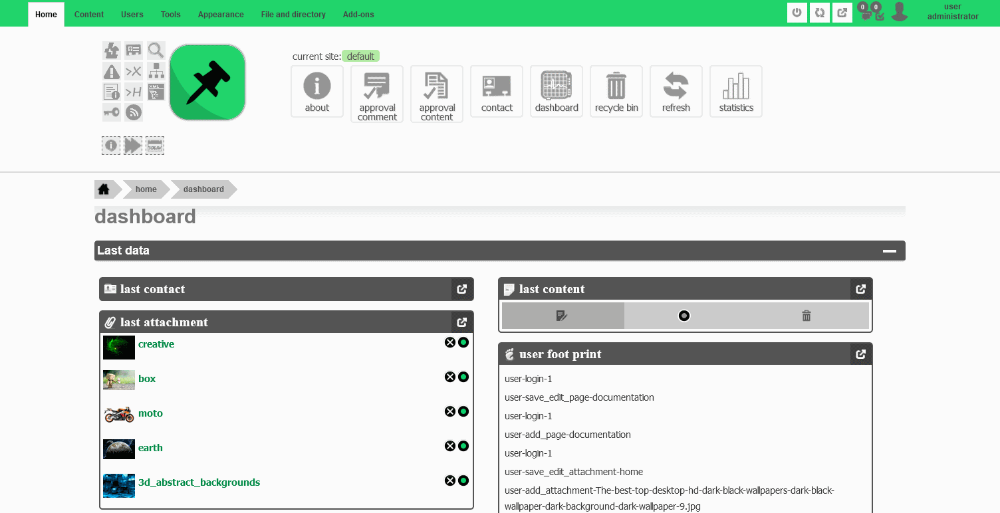

# Elanat

## Big surprise, the new version of Elanat is prepared on .NET Core and the new source will be released in August 2023. Elanat is the largest system ever migrated from .NET Standard to .NET Core. Elanat migration is done by using [Code_behind](https://github.com/elanatframework/Code_behind) infrastructure.

Elanat framework is one of the best systems on the web. There is also a built-in CMS in Elanat core. Elanat uses an internal MVC architecture that is not related to Microsoft ASP.NET MVC.
This system is very powerful and very large and it benefits from a very modern structure that allows you to create up to 20 new add-ons for Elanat every day.
The wonderful structure of Elanat is in a way that it interacts with 8 types of add-ons, all of which are components, and the component itself is also a component. In the admin section, all component lists and other add-ons are displayed by the plugin add-on.
There are nearly 600 executable aspx files, 56 DBMS tables, 560 stored procedures, more than 600 XML files and nearly 70 JavaScript files in Elanat core.
At Elanat, we have introduced several new technologies in web-based systems; Some of these technologies include the following:

 - Server-side independence
 - add-on-oriented
 - Socket-connector
 - Library switcher

We also used several high-level technologies:

 - Structure box and list item
 - The separation of the template from the style
 - Content name value
 - Variables in the content template

In many cases, the Elanat system is better than Microsoft SharePoint, Drupal and Liferay.

Elanat runs all available programming languages, both web-based and hardware-based. You just need to create your add-on in your favorite programming language. A small list of programming languages supported by Elanat:
C, C++
PHP
Python
ruby
Perl
node.js

We plan to make structural modifications to Elanat, so the core of Elanat will be modified by ourselves. We encourage you to create your own add-on for Elanat; The link below is Elanat separate add-on repository and you can add any add-on you like in this repository.
https://github.com/elanatframework/Elanat_add-ons

add-ons

According to the list below, There are 8 different types of add-ons in Elanat :

 - Component
 - Module
 - Plugin
 - Patch
 - Page
 - Fetch
 - Extra helper
 - Editor template

Component : Component can have different definitions or meanings in each system. In the Elanat framework, add-ons that only administrators role have access to are called components. plugins, modules, and the component itself each have a component management page.

Module : Modules and plugins are a kind of add-on that can be displayed in any part of the website; add-ons in Elanat framework that being able to display, provide separate management for the add-on, are called modules.

Plugin : Add-ons that are purely visual and do not have a management page are called plugins.

Patch : After installing this add-on, it creates a series of changes in Elanat framework and has no page to display.

Page : The page is a type of add-on that is displayed in the site section of the Elanat framework. The page can be static or dynamic.

Fetch : Fetch is a add-on that combines database queries with HTML tags and can be displayed on any page or add-on from the Elanat framework. This add-on can be run without displaying the values and make changes in the database only after running.

Extra helper : Extra helpers are add-ons that only showed in admin section of Elanat framework and only administrators access to this add-ons.

Editor template : Editor templates add-ons are part of a html page template; each of the Editor templates helps content writers use a ready-made template to create pages faster and more organized. 

Elanat 1.0.4.2
--------------

Elanat is Add-on oriented framework on the web.

Elanat Copyright (C) 2022-2023 Mohammad Rabie.

The main features of Elanat: 

  - Supports all programming languages
  - Include eight various add-on :
     Component, Module, Patch, Plugin, Page, Fetch, Extra helper, Editor template
  - Inner MVC structer
  - Dynamic add-ons

Elanat is free software under the GNU GPLV3.
Read App_Data/elanat_system_data/license/en/license.txt for more information about license.

Website :
  elanat.net

Elanat policy on Github :
	In order to Migrating to the new server-side programming language, maintain add-on oriented, stability, integrity, performance, security, structure management, dependency prevention, and other such reasons, we develop the Elanat core by ourselves according to user feedback and using modern structures; We encourage developers to create new add-ons for Elanat.

New Source Version :
	The Elanat source is published on the github.com website when the first number is added or the second number reaches 5 (the source of each new version of Elanat is published on the elanat.net website) similar to 1.5.x.x or 2.x.x.x
	If there is a security problem (such as XSS Attack or SQL Injection) or a struct problem (such as loop occur) or any other serious problem, the modified Elanat source will also be published on github.com website.

Tools used in creating Elanat:

	- ASP.NET Standard 4.5
	- SQLServer
	- Tinymce
	- Codemirror
	- Ionic.Zip.dll
	- MySqlConnector.dll
	- File Icons Vs. 3 Icons by Jordan Michael

--------------
